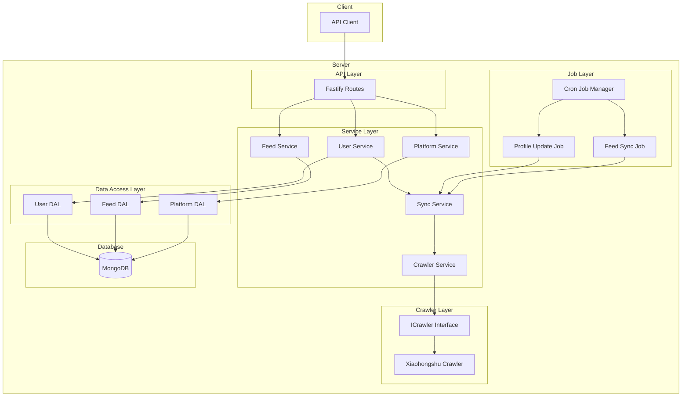
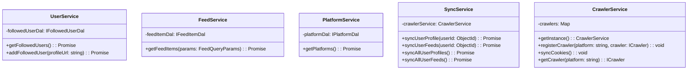
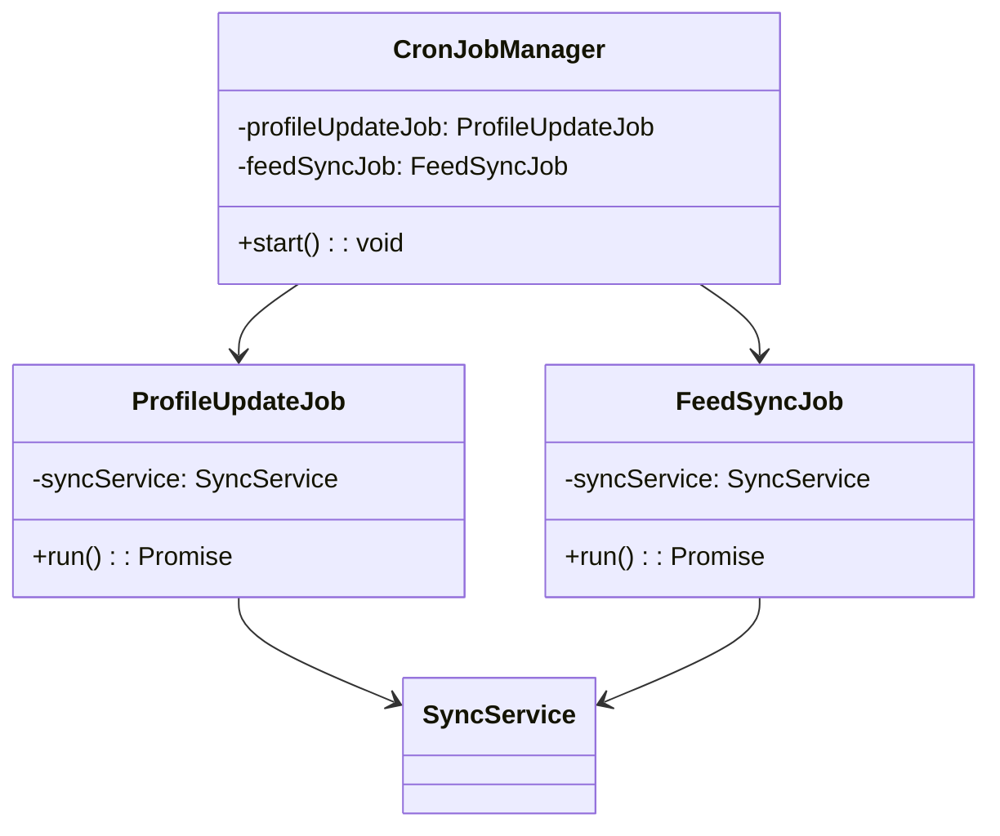

# Aggregated Feed Service Architecture

## System Overview

The Aggregated Feed Service is a Node.js-based application that aggregates social media feeds from various platforms (currently supporting Xiaohongshu) and provides a unified API for accessing the content.

## Architecture Diagram



## Class Diagrams

### Service Layer



### Data Access Layer

```mermaid
classDiagram
    class IFollowedUserDal {
        <<interface>>
        +getFollowedUsers(): Promise<FollowedUserDTO[]>
        +addFollowedUser(profileUrl: string): Promise<FollowedUserDTO>
        +removeFollowedUser(userId: string): Promise<{success: boolean}>
    }

    class IFeedItemDal {
        <<interface>>
        +getFeedItems(params: FeedQueryParams): Promise<FeedItemDTO[]>
    }

    class IPlatformDal {
        <<interface>>
        +getPlatforms(): Promise<PlatformDTO[]>
    }

    class FollowedUserDalImpl {
        +getFollowedUsers(): Promise<FollowedUserDTO[]>
        +addFollowedUser(profileUrl: string): Promise<FollowedUserDTO>
        +removeFollowedUser(userId: string): Promise<{success: boolean}>
    }

    class FeedItemDalImpl {
        +getFeedItems(params: FeedQueryParams): Promise<FeedItemDTO[]>
    }

    class PlatformDalImpl {
        +getPlatforms(): Promise<PlatformDTO[]>
    }

    IFollowedUserDal <|.. FollowedUserDalImpl
    IFeedItemDal <|.. FeedItemDalImpl
    IPlatformDal <|.. PlatformDalImpl
```

### Crawler Layer

```mermaid
classDiagram
    class ICrawler {
        <<interface>>
        +syncCookie(): void
        +fetchUserProfile(profileUrl: string): Promise<UserProfile>
        +fetchLatestPosts(profileUrl: string, cursor: string): Promise<{posts: Post[], cursor: string}>
    }

    class XiaohongshuCrawler {
        -backEndUrl: string
        -cookies: string
        +syncCookie(): void
        +fetchUserProfile(profileUrl: string): Promise<UserProfile>
        +fetchLatestPosts(profileUrl: string, cursor: string): Promise<{posts: Post[], cursor: string}>
        -makeRequest(url: string, api: string, method: string, data?: any): Promise<any>
        -extractUserId(profileUrl: string): string
        -extractApiPathAndQuery(profileUrl: string): string
    }

    ICrawler <|.. XiaohongshuCrawler
```

### Job Layer



## Key Components

1. **API Layer**
   - Fastify-based REST API
   - Routes for platforms, feeds, and user management
   - Input validation and error handling

2. **Service Layer**
   - Business logic implementation
   - Orchestration of data operations
   - Integration with crawler services

3. **Data Access Layer**
   - Interface-based design for data access
   - MongoDB implementation
   - Data transfer objects (DTOs) for API responses

4. **Crawler Layer**
   - Platform-specific crawler implementations
   - Cookie management
   - Profile and feed data extraction

5. **Job Layer**
   - Scheduled tasks for data synchronization
   - Profile updates and feed synchronization
   - Error handling and logging

## Data Flow

1. **Feed Aggregation Flow**
   - User adds a profile URL
   - System crawls the profile and initial feed
   - Regular sync jobs update the feed
   - API provides access to aggregated content

2. **Profile Update Flow**
   - Daily cron job triggers profile updates
   - System fetches latest profile information
   - Updates stored user data
   - Updates related feed items

3. **Feed Sync Flow**
   - Daily cron job triggers feed sync
   - System fetches latest posts
   - Updates feed items in database
   - Maintains sync cursor for incremental updates
